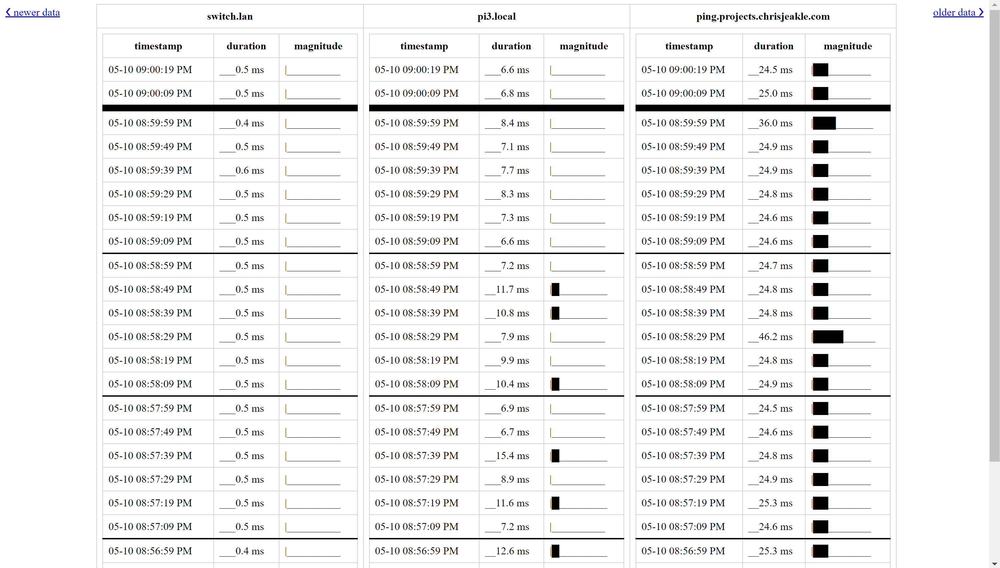

# Network Monitor
A utility to help monitor and assess network performance

## Build
* [Install `rustup`](https://www.rust-lang.org/tools/install): `curl --proto '=https' --tlsv1.2 -sSf https://sh.rustup.rs | sh`
* This project uses nightly features: `rustup install nightly`
* Ensure you're up-to-date (`rustup update`)
* Build the LAN-side application:
  ```
  cargo fmt --manifest-path=LAN/Cargo.toml && \
  cargo +nightly build --manifest-path=LAN/Cargo.toml && \
  sudo setcap cap_net_admin,cap_net_raw=eip LAN/target/debug/network-monitor
  ```
* Test the LAN-side application:
  ```
  LAN/target/debug/network-monitor 192.168.1.1 ping.projects.chrisjeakle.com
  ```
  * By default the UI is available at http://0.0.0.0:8180

## Deploy

### Web hosted latency test
* Set up the web pages:
  * On the server: `ssh root@projects.chrisjeakle.com 'mkdir /var/www/html/ping/'`
  * Upload the latency test page to the server: `scp -pr WAN/html root@projects.chrisjeakle.com:/var/www/html/ping/`
* Configure nginx:
  * `scp WAN/nginx/ping.conf root@projects.chrisjeakle.com:/etc/nginx/conf.d/ping.conf`
  * On the server: `ssh root@projects.chrisjeakle.com 'service nginx reload'`
* Test the config
  * Ensure ICMP pings work (so the LAN tool can ping this WAN destination): `ping -c 4 ping.projects.chrisjeakle.com`
  * Ensure there's no redirects: `curl -H 'Cache-Control: no-cache' http://ping.projects.chrisjeakle.com/ping/ -I -k`
  * `curl http://ping.projects.chrisjeakle.com/ping/`
  * Visit in a browser: http://ping.projects.chrisjeakle.com/

### LAN ping monitoring tool

#### Initial Deploy
* SSH into a LAN device to host the software
* Configure the application by editing `LAN/config.rs`
* Build the application
  * `cargo +nightly build --release --manifest-path=LAN/Cargo.toml`
* Copy the binary to the appropriate folder on the LAN device
  * `sudo mkdir -p /usr/bin/network-monitor/`
  * `sudo cp LAN/target/release/network-monitor /usr/bin/network-monitor/network-monitor`
* Apply capabilities so the program is permitted to create raw sockets
  * `sudo setcap cap_net_admin,cap_net_raw=eip /usr/bin/network-monitor/network-monitor`
  * Verify it worked using: `getcap /usr/bin/network-monitor/network-monitor`
* Create a new non-root user to run the service
  * `sudo useradd --system network-monitor`
    * Create a `system`  user, we have no need for interactive shell sessions or a home dir
* Create a service to auto-start the application
  * `sudo cp LAN/systemd/network-monitor.service /etc/systemd/system/network-monitor.service`
* Edit the service definition to ping the hosts you want to ping
  * `sudo vim /etc/systemd/system/network-monitor.service`
  * Edit the command line args at the end of the `ExecStart=` line under `[Service]`
* Enable the service and start it
  * `sudo systemctl enable network-monitor.service && sudo systemctl start network-monitor.service`
  * Monitor service health:
    * `sudo systemctl status network-monitor.service`
    * `sudo journalctl -u network-monitor | less +G`
* View the network ping logs in a browser at http://localhost:8180 or http://pi4.local:8180

#### Updates
Binary update script:
```
git pull && \
cargo +nightly build --release --manifest-path=LAN/Cargo.toml && \
sudo systemctl stop network-monitor.service && \
sudo cp LAN/target/release/network-monitor /usr/bin/network-monitor/ && \
sudo setcap cap_net_admin,cap_net_raw=eip /usr/bin/network-monitor/network-monitor && \
sudo systemctl start network-monitor.service && \
sudo getcap /usr/bin/network-monitor/network-monitor && \
sudo systemctl status network-monitor.service
```

#### Screenshots
The UI:

